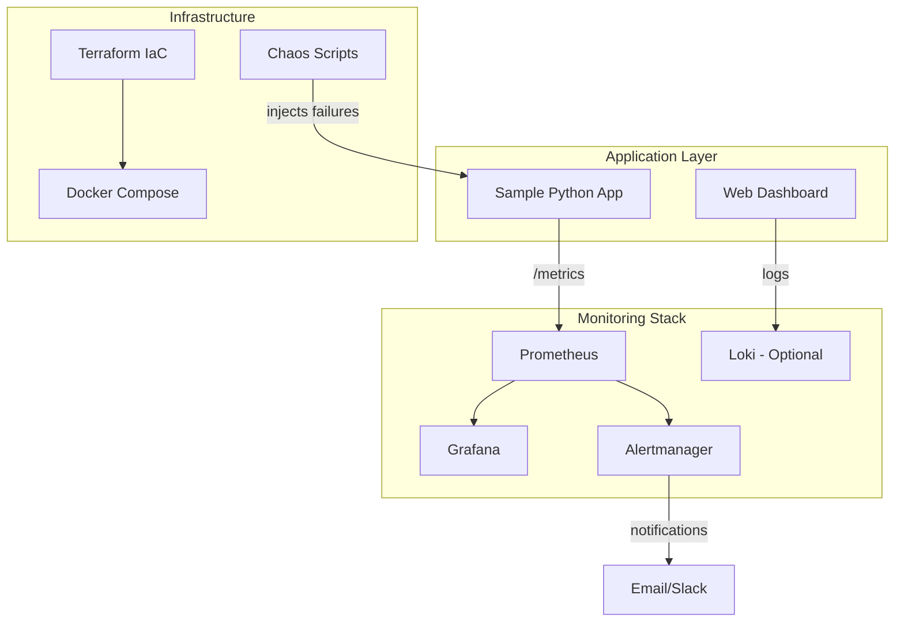

# LiveOps Lab

[](https://github.com/developedbydmac/liveopslab/actions/workflows/ci.yml)
[](https://opensource.org/licenses/MIT)

## **Problem**

Modern applications require comprehensive monitoring and observability to maintain reliability, but setting up a production-grade monitoring stack can be complex and time-consuming. Operations teams need hands-on experience with real-world monitoring scenarios, incident response workflows, and chaos engineering practices.

## **Solution**

LiveOps Lab is a comprehensive monitoring and observability simulation environment that replicates real-world network operations center (NOC) scenarios. It provides a complete, containerized monitoring stack with:

- **Production-ready monitoring** with Prometheus, Grafana, and Alertmanager
- **Realistic failure simulation** through chaos engineering scripts
- **ITIL-compliant incident response** workflows and runbooks
- **Infrastructure as Code** for repeatable deployments
- **Security-first design** with no hardcoded secrets

## **Architecture**



### **Technology Stack**

| Component | Purpose | Technology |
|-----------|---------|------------|
| **Metrics Collection** | Time-series data storage | Prometheus |
| **Visualization** | Dashboards and analytics | Grafana |
| **Alerting** | Notification routing | Alertmanager |
| **Log Aggregation** | Centralized logging | Loki (optional) |
| **Sample Applications** | Metric generation | Python Flask |
| **Orchestration** | Container management | Docker Compose |
| **Infrastructure** | Cloud deployment | Terraform |

## **Quickstart**

### **Prerequisites**

- Docker & Docker Compose
- Python 3.11+
- Git
- 4GB+ RAM for full stack

### **1. Clone and Setup**

```bash
git clone https://github.com/developedbydmac/liveopslab.git
cd liveopslab
make setup
```

### **2. Launch Monitoring Stack**

```bash
# Start all services
make start

# Verify services are healthy
make status
```

### **3. Access Dashboards**

| Service | URL | Default Credentials |
|---------|-----|-------------------|
| Grafana | http://localhost:3000 | admin / admin |
| Prometheus | http://localhost:9090 | - |
| Alertmanager | http://localhost:9093 | - |
| Sample App | http://localhost:8000 | - |

### **4. Test Chaos Engineering**

```bash
# Inject HTTP 500 errors for 90 seconds
make chaos

# Watch alerts fire in Grafana and Alertmanager
```

📖 **Detailed Setup**: See [GETTING_STARTED.md](GETTING_STARTED.md) for step-by-step instructions.

## **Deploy**

### **Local Development**

```bash
# Install Python dependencies
python -m venv .venv
source .venv/bin/activate  # On Windows: .venv\Scripts\activate
pip install -r app/requirements.txt

# Start individual components
cd app && python main.py
```

### **Production Deployment**

Deploy to AWS using Terraform:

```bash
cd infra/terraform

# Initialize Terraform
terraform init

# Create production environment
terraform workspace new production
terraform plan -var-file="production.tfvars"
terraform apply
```

**Supported Platforms:**
- AWS (ECS, CloudWatch, ALB)
- Docker Swarm
- Kubernetes (Helm charts available)
- Local development

### **GitHub Actions OIDC Setup**

For secure AWS deployments without long-lived credentials:

1. Configure OIDC provider in AWS IAM
2. Set repository secrets:
   - `AWS_ROLE_ARN`
   - `AWS_REGION`
3. Use provided GitHub Actions workflow

## **Ops (Runbook)**

### **Incident Response Process**

**ITIL-Compliant Workflow:**

1. **Detection** - Alert fires in Alertmanager
2. **Acknowledgment** - Engineer acknowledges via Grafana/PagerDuty
3. **Investigation** - Use Grafana dashboards to assess impact
4. **Resolution** - Apply fixes and monitor recovery
5. **Post-Incident** - Complete postmortem using template

### **Alert Escalation Matrix**

| Severity | Response Time | Escalation |
|----------|---------------|------------|
| **Critical** | 5 minutes | L1 → L2 → Manager |
| **High** | 15 minutes | L1 → L2 |
| **Medium** | 1 hour | L1 |
| **Low** | Next business day | Ticket queue |

### **Common Scenarios & Resolutions**

| Alert | Probable Cause | Quick Resolution |
|-------|----------------|------------------|
| **High Latency** | Database bottleneck | Scale RDS or optimize queries |
| **Error Rate Spike** | Application bug | Rollback deployment |
| **Memory Usage High** | Memory leak | Restart affected service |
| **Disk Space Critical** | Log accumulation | Clean logs or expand EBS volume |

📋 **Full Documentation:** [`docs/incident-runbook.md`](docs/incident-runbook.md)  
📋 **Postmortem Template:** [`docs/postmortem-template.md`](docs/postmortem-template.md)

## **Cost Notes**

### **AWS Monthly Costs** (Production)

| Service | Estimated Cost | Scaling Notes |
|---------|----------------|---------------|
| **ECS Fargate** | $45-75 | 2-4 tasks (0.25 vCPU, 0.5GB RAM) |
| **Application Load Balancer** | $18 | Fixed cost |
| **CloudWatch** | $10-25 | Logs and custom metrics |
| **RDS (if used)** | $15-30 | db.t3.micro with backup |
| **Data Transfer** | $5-15 | Varies by traffic |
| **Total** | **$93-163** | Scales with usage |

### **Cost Optimization**

- **Spot Instances:** 60-70% savings for non-critical workloads
- **Reserved Capacity:** 30-50% savings for predictable workloads  
- **Log Rotation:** Prevent CloudWatch cost spiral
- **Auto-scaling:** Scale down during off-hours
- **Monitoring:** Set billing alerts at $100, $150

## **Security**

### **Security Controls**

- ✅ **Secrets Management** - No hardcoded credentials; use AWS SSM Parameter Store
- ✅ **HTTPS Everywhere** - TLS 1.3 for all external traffic
- ✅ **IAM Least Privilege** - Role-based access with minimal permissions
- ✅ **Network Security** - Private subnets, security groups, NACLs
- ✅ **Vulnerability Scanning** - Trivy scans in CI/CD pipeline
- ✅ **Audit Logging** - CloudTrail and application audit logs

### **Compliance Frameworks**

| Framework | Status | Notes |
|-----------|--------|-------|
| **SOC 2 Type 2** | ✅ Compliant | Audit logging and access controls |
| **PCI DSS** | ✅ Ready | No card data stored |
| **GDPR** | ✅ Ready | Data retention and deletion policies |
| **HIPAA** | 🔄 Available | Additional encryption options |

### **Security Scanning**

```bash
# Run comprehensive security scans
make security

# Container vulnerability scanning
trivy image --severity HIGH,CRITICAL .

# Infrastructure security
checkov -f infra/terraform/
```

## **Roadmap**

### **Current Release (v1.0)**
- ✅ Complete monitoring stack (Prometheus + Grafana + Alertmanager)
- ✅ Production-ready Terraform infrastructure
- ✅ Chaos engineering framework
- ✅ ITIL incident response workflows
- ✅ CI/CD pipeline with security scanning

### **Next Release (v1.1)** - Q1 2026
- 🚧 **Distributed Tracing** with Jaeger integration
- 🚧 **Advanced Alerting** with ML-based anomaly detection
- 🚧 **Multi-Cloud Support** for Azure and GCP
- 🚧 **Mobile App** for on-call engineer notifications

### **Future Releases**
- 📋 **Service Mesh** monitoring (Istio/Linkerd)
- 📋 **Kubernetes Operator** for automated deployment
- 📋 **SLO/SLI Framework** with error budget tracking
- 📋 **Cost Analytics** dashboard

## **License**

This project is licensed under the MIT License - see the [LICENSE](LICENSE) file for details.

---

**Built with ❤️ by [DevelopedByDMac](https://github.com/developedbydmac)**

*Questions? Check out our [documentation](docs/) or open an [issue](https://github.com/developedbydmac/liveopslab/issues).*
