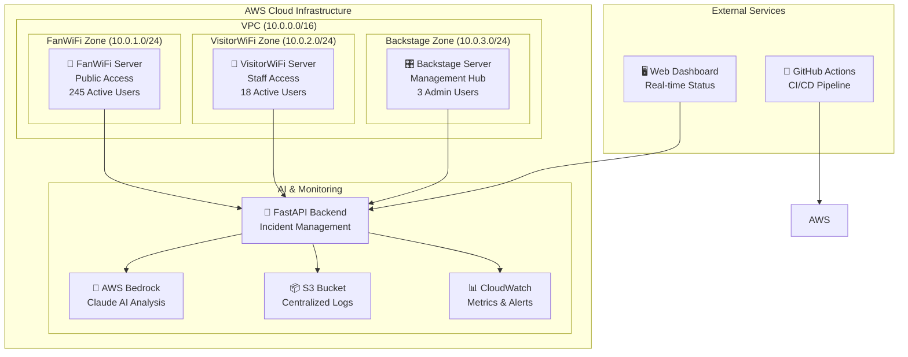

# 🏟️ LiveOpsLab - AI-Powered Venue Network Management

[](https://github.com/developedbydmac/liveopslab/actions/workflows/deploy.yml)
[](https://opensource.org/licenses/MIT)
[](https://www.python.org/downloads/)
[](https://fastapi.tiangolo.com/)
[](https://terraform.io/)

## 🎯 Overview

LiveOpsLab is a comprehensive incident management platform designed for venue network operations. It combines infrastructure automation, chaos engineering, and AI-powered root cause analysis to ensure maximum uptime for critical venue services.

### 🌟 Key Features

- **🏗️ Infrastructure as Code**: Complete AWS infrastructure with Terraform
- **🤖 AI-Powered Analysis**: AWS Bedrock integration for intelligent incident triage  
- **🌪️ Chaos Engineering**: Automated resilience testing and failure simulation
- **📊 Real-time Monitoring**: Prometheus, Grafana, and CloudWatch integration
- **🚨 Incident Management**: FastAPI backend with automated response workflows
- **📈 Live Dashboard**: Real-time venue network status visualization
- **🔄 CI/CD Pipeline**: Automated deployment and testing with GitHub Actions

## 🏗️ Architecture

### Network Zones



## 🚀 Quick Start

### Prerequisites

- **AWS Account** with appropriate permissions
- **Terraform** >= 1.0
- **Python** >= 3.11
- **Git** for version control

### 1. Infrastructure Deployment

```bash
# Clone the repository
git clone https://github.com/developedbydmac/liveopslab.git
cd liveopslab

# Initialize and deploy infrastructure
terraform init
terraform plan
terraform apply -auto-approve

# Get deployment outputs
terraform output
```

### 2. FastAPI Backend Setup

```bash
# Navigate to backend directory
cd backend

# Install dependencies
pip install -r requirements.txt

# Set environment variables
export AWS_REGION=us-east-1
export AWS_ACCESS_KEY_ID=your_key
export AWS_SECRET_ACCESS_KEY=your_secret

# Start the API server
uvicorn main:app --host 0.0.0.0 --port 8000 --reload
```

### 3. Dashboard Access

```bash
# Start dashboard server
cd dashboard
python -m http.server 3000

# Access at: http://localhost:3000
```

## 🧪 Testing & Demo

### Health Check

```bash
# Test API health
curl http://localhost:8000/health

# Expected response:
{
  "status": "healthy",
  "timestamp": "2025-01-28T10:30:00Z",
  "zones_monitored": 3,
  "active_incidents": 0
}
```

### Simulate Incidents

```bash
# Simulate network failure in FanWiFi zone
curl -X POST http://localhost:8000/simulate-outage/FanWiFi \
  -H "Content-Type: application/json" \
  -d '{
    "outage_type": "network_failure",
    "duration_seconds": 300,
    "severity": "high",
    "description": "Demo network failure"
  }'

# Check zone status
curl http://localhost:8000/status/FanWiFi

# View incident with AI analysis
curl http://localhost:8000/incidents
```

## 🤖 AI-Powered Features

### Root Cause Analysis

The system uses AWS Bedrock with Claude AI for intelligent incident analysis:

```json
{
  "root_cause": "Network interface failure due to high traffic load",
  "confidence_level": 0.87,
  "recommended_fix": "Restart network services and implement load balancing",
  "preventive_measures": [
    "Implement auto-scaling for network interfaces",
    "Add redundant network paths",
    "Set up bandwidth monitoring alerts"
  ],
  "escalation_needed": false,
  "estimated_recovery_time": "5-10 minutes"
}
```

### Automated Triage

- **High-confidence incidents**: Auto-remediation triggered
- **Medium-confidence incidents**: Alert sent to on-call engineer
- **Low-confidence incidents**: Escalated to senior staff

## 🌪️ Chaos Engineering

### Available Tests

```bash
# Network failure simulation
POST /simulate-outage/FanWiFi
{
  "outage_type": "network_failure",
  "duration_seconds": 300
}

# High latency injection
POST /simulate-outage/VisitorWiFi
{
  "outage_type": "high_latency", 
  "duration_seconds": 180
}

# CPU spike simulation
POST /simulate-outage/Backstage
{
  "outage_type": "cpu_spike",
  "duration_seconds": 240
}
```

### Automated Recovery

All simulated incidents automatically recover after the specified duration, allowing for:

- Recovery time validation
- Service restoration testing
- Alert resolution verification
- Post-incident analysis

## 📊 Dashboard Features

### Real-time Status Display

The web dashboard provides:

- **Zone Status Cards**: 🟢 Healthy, 🟡 Degraded, 🔴 Outage, 🟣 Maintenance
- **Key Metrics**: Uptime %, Active Users, Latency, CPU/Memory Usage
- **Incident Information**: Recent incidents with AI analysis summary
- **Interactive Controls**: Simulate outages, refresh data, view details

### Auto-refresh

- Updates every 30 seconds automatically
- Manual refresh available
- Connection status indicator
- Error handling with retry options

## 🔄 CI/CD Pipeline

### GitHub Actions Workflow

The automated pipeline includes:

```yaml
stages:
  - validate-terraform    # Infrastructure validation
  - test-backend         # API testing
  - deploy-infrastructure # AWS deployment
  - deploy-backend       # Application deployment
  - chaos-tests          # Resilience testing
  - notification         # Status reporting
```

### Deployment Environments

- **🧪 Development**: Feature testing and validation
- **🎭 Staging**: Pre-production chaos testing  
- **🏟️ Production**: Live venue operations

## 🛠️ API Endpoints

### Core Endpoints

| Endpoint | Method | Description |
|----------|--------|-------------|
| `/health` | GET | Service health check |
| `/status` | GET | All zones status |
| `/status/{zone}` | GET | Individual zone status |
| `/simulate-outage/{zone}` | POST | Simulate outage |
| `/replay/{incident_id}` | GET | Incident analysis |
| `/incidents` | GET | List all incidents |

### Interactive Documentation

Access full API documentation at: `http://localhost:8000/docs`

## 🔧 Configuration

### Environment Variables

```bash
# AWS Configuration
AWS_REGION=us-east-1
AWS_ACCESS_KEY_ID=your_access_key
AWS_SECRET_ACCESS_KEY=your_secret_key

# Application Settings
FASTAPI_HOST=0.0.0.0
FASTAPI_PORT=8000
LOG_LEVEL=INFO

# AI Integration
BEDROCK_MODEL_ID=anthropic.claude-3-sonnet-20240229-v1:0
AI_ANALYSIS_ENABLED=true
```

### Terraform Variables

Key configuration options in `terraform.tfvars`:

```hcl
# Basic Configuration
aws_region = "us-east-1"
project_name = "liveopslab"
environment = "dev"

# Network Configuration
vpc_cidr = "10.0.0.0/16"
fanwifi_subnet_cidr = "10.0.1.0/24"
visitorwifi_subnet_cidr = "10.0.2.0/24"
backstage_subnet_cidr = "10.0.3.0/24"

# Instance Configuration
fanwifi_instance_type = "t3.medium"
visitorwifi_instance_type = "t3.small"
backstage_instance_type = "t3.medium"

# Chaos Engineering
enable_chaos_testing = true
```

## 🔒 Security Features

### Network Security

- **VPC Isolation**: Separate network zones with controlled access
- **Security Groups**: Tier-specific firewall rules
- **IAM Roles**: Least privilege access for resources
- **Encrypted Storage**: S3 and EBS encryption enabled

### API Security

- **CORS Configuration**: Controlled cross-origin requests
- **Input Validation**: Pydantic models for request validation
- **Error Handling**: Secure error responses without sensitive data
- **Rate Limiting**: Protection against abuse

## 💰 Cost Optimization

### Estimated Monthly Costs

| Component | Quantity | Monthly Cost |
|-----------|----------|--------------|
| EC2 t3.medium | 3 instances | $67.32 |
| EBS gp3 Storage | 300GB | $24.00 |
| Elastic IPs | 3 IPs | $10.95 |
| S3 Standard | 100GB | $2.30 |
| CloudWatch Logs | 50GB | $2.50 |
| Data Transfer | 1TB | $90.00 |
| **Total** | | **~$197/month** |

### Cost Optimization Tips

- Use spot instances for development
- Implement auto-shutdown schedules
- Optimize storage with lifecycle policies
- Monitor and right-size instances

## 🧪 Advanced Testing

### Chaos Test Suite

Run comprehensive chaos engineering tests:

```bash
# Execute all chaos tests
python scripts/chaos_test_suite.py

# Example output:
🌪️ Starting LiveOpsLab Chaos Engineering Tests
✅ PASSED: API Health Check
✅ PASSED: Network Failure Simulation  
✅ PASSED: High Latency Simulation
✅ PASSED: CPU Spike Simulation
✅ PASSED: Incident Recovery
✅ PASSED: AI Analysis Integration

📊 TOTAL: 12 tests | PASSED: 11 | FAILED: 0 | WARNINGS: 1
```

### Performance Testing

```bash
# Load testing with concurrent users
python scripts/load_test.py --users 100 --duration 300

# Stress testing specific endpoints
python scripts/stress_test.py --endpoint /status --rps 50
```

## 🔧 Troubleshooting

### Common Issues

#### API Connection Failures
```bash
# Check service status
curl -I http://localhost:8000/health

# Verify FastAPI is running
ps aux | grep uvicorn

# Check port availability
lsof -i :8000
```

#### Dashboard Not Loading
```bash
# Check dashboard server
python -m http.server 3000

# Verify API connectivity
curl -f http://localhost:8000/status
```

#### AWS Bedrock Issues
```bash
# Check AWS credentials
aws sts get-caller-identity

# Verify Bedrock access
aws bedrock list-foundation-models --region us-east-1
```

## 🤝 Contributing

### Development Setup

```bash
# Fork and clone the repository
git clone https://github.com/your-username/liveopslab.git
cd liveopslab

# Set up development environment
python -m venv venv
source venv/bin/activate
pip install -r backend/requirements.txt
pip install -r requirements-dev.txt

# Run tests
pytest backend/tests/ -v
```

### Code Standards

- **Python**: Follow PEP 8, use type hints, write comprehensive tests
- **Terraform**: Use consistent naming, include proper tags, document variables
- **Documentation**: Update README and API docs for any changes

## 📚 Additional Resources

### Documentation
- [📖 API Documentation](http://localhost:8000/docs) - Interactive API docs
- [🎯 Architecture Guide](docs/architecture.md) - Detailed system design
- [🔧 Deployment Guide](docs/deployment.md) - Step-by-step deployment
- [🧪 Testing Guide](docs/testing.md) - Comprehensive testing procedures

### External Links
- [FastAPI Documentation](https://fastapi.tiangolo.com/)
- [Terraform AWS Provider](https://registry.terraform.io/providers/hashicorp/aws/latest/docs)
- [AWS Bedrock Documentation](https://docs.aws.amazon.com/bedrock/)
- [Prometheus Monitoring](https://prometheus.io/docs/)

## 📄 License

This project is licensed under the MIT License - see the [LICENSE](LICENSE) file for details.

## 🙏 Acknowledgments

- **AWS Bedrock Team** for AI integration capabilities
- **FastAPI Community** for excellent async framework
- **Terraform Team** for infrastructure automation
- **Chaos Engineering Community** for resilience practices

---

## 📞 Support

For support and questions:

- 💬 **GitHub Discussions**: [Community Forum](https://github.com/developedbydmac/liveopslab/discussions)  
- 🐛 **Bug Reports**: [Issue Tracker](https://github.com/developedbydmac/liveopslab/issues)
- 📚 **Documentation**: [Wiki](https://github.com/developedbydmac/liveopslab/wiki)

---

<div align="center">

**Made with ❤️ for venue operations teams worldwide**

[](https://github.com/developedbydmac/liveopslab/stargazers)
[](https://github.com/developedbydmac/liveopslab/network/members)

</div>
