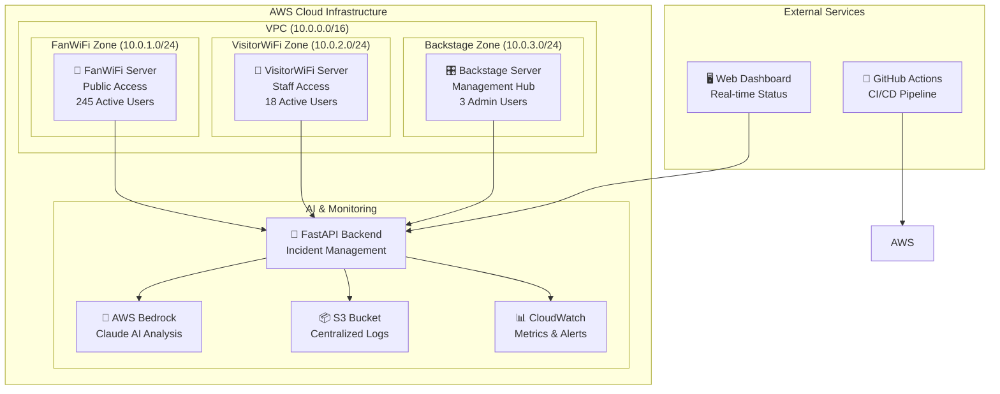

# LiveOpsLab Network Operations Center

[](https://opensource.org/licenses/MIT)
[](https://www.python.org/downloads/)
[](http://localhost:8889)

> **Real-time Network Monitoring Dashboard with Executive Insights, Root Cause Analysis, and Auto-Healing Simulation**

A sophisticated network operations dashboard designed for both technical teams and executive management, featuring real-time incident tracking, root cause analysis, and automated healing simulations.

---

## 🚀 Quick Start

```bash
# Clone and setup
git clone https://github.com/developedbydmac/liveopslab.git
cd liveopslab

# Start the dashboard server
python3 simple_dashboard_server.py

# In another terminal, start the live demo
python3 live_demo_simulator.py

# Open browser to http://localhost:8889
```

## 📊 Dashboard Versions Comparison

### 🔧 Basic Network Dashboard (`network_dashboard.html`)
**Target Audience: Technical Teams & NOC Operations**

#### ✅ Strengths
- **Simple 10x5 Grid Layout**: Clean visualization of 50 access points
- **Real-time Status Indicators**: Color-coded dots (🟢 Green, 🟡 Yellow, 🔴 Red)
- **Lightweight Performance**: Minimal resource usage, fast loading
- **Quick Deployment**: Easy setup with basic HTML/JavaScript
- **Hover Tooltips**: Essential device information on demand
- **NOC-Optimized**: Perfect for technical monitoring workflows

#### ❌ Limitations
- No executive summary or high-level KPIs
- Limited contextual information without root cause data
- Basic UI not suitable for management presentations
- No historical incident tracking capabilities
- Poor mobile responsiveness
- Fixed configuration for 50 access points only

#### 🎯 Best Use Cases
- **Network Operations Centers (NOC)**: Real-time status monitoring
- **Technical IT Teams**: Quick issue identification and response
- **Development Environments**: Testing and troubleshooting
- **Small to Medium Networks**: Less than 100 devices
- **Internal Operations**: Non-client-facing monitoring

---

### 👔 Executive Dashboard (`executive_dashboard.html`)
**Target Audience: Executives, Managers, Operations Teams**

#### ✅ Strengths
- **Executive Summary Cards**: High-level KPIs with trend indicators
  - Network Health percentage with visual trends
  - Active Issues count with priority classification
  - Critical Alerts requiring immediate attention
  - Average Response Time with performance metrics
- **Professional Design**: Boardroom-ready presentation quality
- **Comprehensive Root Cause Analysis**: 10 different incident types
  - Power fluctuation, Network congestion, Hardware failure
  - Configuration errors, ISP connectivity, Firmware bugs
  - Temperature spikes, Cable disconnections, Auth server issues
  - DHCP pool exhaustion with detailed descriptions
- **Auto-Healing Tracking**: Real-time recovery monitoring with ETAs
- **Zone-Based Performance**: Business unit specific metrics
  - FanWiFi, VisitorWiFi, Backstage performance tracking
- **Responsive Design**: Mobile and tablet optimized
- **Rich Interactive Tooltips**: Comprehensive technical details
- **Real-time Incidents Panel**: Live issue tracking with resolution timelines

#### ❌ Current Limitations
- Higher resource usage due to complex rendering
- Steeper learning curve with more features
- Still configured for fixed 50 AP deployment
- No multi-tenant architecture (yet)

#### 🎯 Best Use Cases
- **Executive Reporting**: C-level status presentations
- **Client Demonstrations**: Professional sales showcases
- **Operations Centers**: Complete network oversight and management
- **Large Enterprise Networks**: Comprehensive monitoring needs
- **SLA Management**: Performance tracking and compliance reporting
- **Incident Response**: Detailed root cause analysis and resolution tracking

---

## 🎮 Live Demo Features

### Real-time Network Simulation
- **Dynamic Status Changes**: Watch APs change from healthy → warning → critical in real-time
- **Automated Incident Generation**: Random network issues every 8 seconds
- **Auto-Healing Demonstration**: Different recovery times based on incident type:
  - **Fast Healing** (30s): Temperature spikes, Power fluctuations
  - **Medium Healing** (60-90s): Network congestion, Auth server issues
  - **Slow Healing** (2-5min): Hardware failures, Firmware bugs
  - **Manual Intervention** (5+ min): Cable disconnections

### Interactive Elements
- **🚨 Incidents Panel**: Click the alert button to see detailed root cause information
- **Hover Tooltips**: Rich information including latency, client count, throughput
- **View Filters**: Toggle between "All APs", "Issues Only", and "Critical" views
- **Executive Metrics**: Real-time updates to summary cards and zone performance

### CLI Integration
```bash
# Send manual alerts via CLI
python3 dashboard_cli.py send-alert AP-15 FanWiFi "hardware_failure" "Radio module malfunction"

# Replay historical incidents
python3 dashboard_cli.py replay --start-date "2024-01-01" --zone "VisitorWiFi"

# Check AP status
python3 dashboard_cli.py ap-status AP-23

# View system status
python3 dashboard_cli.py status
```

---

## 🏗️ Technical Architecture

### Current Implementation
```
Frontend Layer:
├── executive_dashboard.html    # Management-focused dashboard
├── network_dashboard.html      # Technical operations dashboard
└── platform_comparison.html    # Feature comparison page

Backend Services:
├── simple_dashboard_server.py  # HTTP server for dashboard delivery
├── live_demo_simulator.py      # Real-time incident simulation
├── dashboard_cli.py            # Command-line interface
└── incident_logger.py          # Event logging and webhook integration

Data Layer:
├── network_topology.json       # Real-time network state
├── incident_log.json          # Historical incident data
└── Mock data generation        # Simulation engine
```

### Key Components

#### 1. Dashboard Server (`simple_dashboard_server.py`)
- HTTP server with custom routing
- Real-time data serving via JSON API
- Support for multiple dashboard versions
- CORS handling for cross-origin requests

#### 2. Live Demo Simulator (`live_demo_simulator.py`)
- **Incident Engine**: 10 different root cause scenarios
- **Auto-Healing Logic**: Probabilistic recovery based on issue type
- **Real-time Updates**: 8-second simulation cycles
- **Performance Modeling**: Realistic latency and throughput degradation

#### 3. CLI Interface (`dashboard_cli.py`)
- **Webhook Integration**: Slack and Discord notifications
- **Manual Alert Generation**: Custom incident creation
- **Historical Replay**: Time-based incident simulation
- **Status Monitoring**: Real-time system health checks

---

## 🚀 SaaS Platform Evolution Roadmap

### Phase 1: Multi-Tenancy Foundation (3-6 months)
**Investment Required: $500K | Team Size: 5 developers**

#### Core Platform Features
- **Multi-tenant Architecture**: Isolated customer data with PostgreSQL
- **User Authentication**: OAuth2, SAML, SSO integration
- **Role-based Access Control**: Admin, Manager, Operator, Viewer roles
- **Organization Management**: Company profiles, billing, settings
- **RESTful API Gateway**: Rate limiting, authentication, request routing

#### Technical Implementation
```python
# Multi-tenant data model example
class Organization:
    id: UUID
    name: str
    subscription_tier: Enum['starter', 'professional', 'enterprise']
    max_devices: int
    created_at: datetime
    settings: JSONField

class NetworkDevice:
    id: UUID
    organization_id: UUID  # Tenant isolation
    device_type: str
    location: dict
    status: Enum['healthy', 'warning', 'critical']
    last_seen: datetime
```

### Phase 2: Data Intelligence & Analytics (6-9 months)
**Investment Required: $750K | Team Size: 8 developers + 2 data scientists**

#### Advanced Features
- **Historical Analytics**: 1-year data retention with trend analysis
- **Machine Learning Models**: Predictive failure analysis 48hrs ahead
- **Custom Dashboard Builder**: Drag-and-drop interface
- **Automated Reporting**: Scheduled PDF/email reports
- **SLA Monitoring**: Performance guarantee tracking with alerts

#### Business Intelligence
- **Network Health Scoring**: Proprietary algorithms based on 15+ metrics
- **Capacity Planning**: Growth recommendations with investment analysis
- **Cost Optimization**: Performance vs. infrastructure cost analysis
- **Benchmark Comparisons**: Industry standard metrics and peer analysis

### Phase 3: Integration Ecosystem (9-12 months)
**Investment Required: $1M | Team Size: 12 developers + 3 DevOps**

#### Third-party Integrations
- **ITSM Platforms**: ServiceNow, Jira Service Management, Zendesk
- **Monitoring Tools**: Nagios, Zabbix, SolarWinds, Datadog
- **Cloud Providers**: AWS CloudWatch, Azure Monitor, GCP Operations
- **Communication**: Slack, Microsoft Teams, PagerDuty, Discord
- **Network Vendors**: Cisco Prime, Aruba Central, Ubiquiti UniFi

#### Marketplace Features
- **Plugin Architecture**: SDK for custom integrations
- **Community Marketplace**: Third-party add-ons and extensions
- **White-label Solutions**: Partner reseller program with co-branding
- **API Monetization**: Usage-based pricing for API access

### Phase 4: Scale & Innovation (12+ months)
**Investment Required: $1.5M | Team Size: 20+ developers**

#### Advanced Features
- **AI/ML Enhancements**: Anomaly detection, intelligent alerting
- **IoT Platform Expansion**: Smart buildings, fleet management
- **AR/VR Dashboards**: Immersive network visualization
- **Digital Twins**: Virtual network replicas for scenario planning

---

## 💰 SaaS Monetization Strategy

### Pricing Tiers & Revenue Projections

#### 🥉 Starter Plan - $99/month
**Target Market: Small businesses, branch offices (50-200 employees)**
- Up to 50 devices monitored
- Basic dashboard (technical focus)
- Email support (24hr response)
- 30-day data retention
- Standard alerting
- **Year 1 Target**: 500 customers = $594K ARR

#### 🥈 Professional Plan - $299/month  
**Target Market: Mid-size enterprises (200-1,000 employees)**
- Up to 500 devices monitored
- Executive dashboard with full features
- Root cause analysis and auto-healing tracking
- Phone support (4hr response)
- 90-day data retention
- Custom reports and dashboards
- **Year 1 Target**: 200 customers = $717K ARR

#### 🥇 Enterprise Plan - $999/month
**Target Market: Large enterprises, service providers (1,000+ employees)**
- Unlimited devices
- Custom dashboard builder
- Advanced analytics and ML predictions
- Dedicated customer success manager
- 1-year data retention
- API access and integrations
- SSO and advanced security
- **Year 1 Target**: 100 customers = $1.2M ARR

#### 💎 White-label Plan - Custom Pricing
**Target Market: MSPs, System integrators, Network consultants**
- Full platform customization and branding
- Multi-tenant customer management
- Revenue sharing (20-30%)
- Technical support and training
- Co-marketing opportunities
- **Year 1 Target**: 20 partners = $500K ARR

### **Total Year 1 Revenue Projection: $3.01M ARR**

---

## 🎯 Competitive Analysis & Market Positioning

### Primary Competition
| Competitor | Price Range | Strengths | Our Advantage |
|------------|-------------|-----------|---------------|
| **SolarWinds NPM** | $2,995-$11,895 | Enterprise features | 70% cost reduction, modern UI |
| **PRTG Network Monitor** | $1,750-$60,500 | Easy deployment | Better executive reporting |
| **Nagios** | $1,995-$4,495 | Open source options | SaaS delivery, no maintenance |
| **ManageEngine OpManager** | $715-$11,545 | Comprehensive suite | Focused network monitoring |

### Unique Value Propositions
1. **Executive-Ready Dashboards**: Professional presentation quality out-of-the-box
2. **15-Minute Deployment**: Fastest time-to-value in the industry
3. **AI-Powered Insights**: Predictive analytics vs. reactive monitoring
4. **Auto-Healing Intelligence**: Proactive problem resolution
5. **Cost Efficiency**: 60-70% less than traditional enterprise solutions

### Market Opportunity
- **Total Addressable Market (TAM)**: $50.7B global network monitoring market
- **Serviceable Addressable Market (SAM)**: $12.3B cloud-based monitoring
- **Serviceable Obtainable Market (SOM)**: $500M SMB and mid-market segment

---

## 🛠️ Development & Deployment

### Prerequisites
- Python 3.8 or higher
- Modern web browser (Chrome, Firefox, Safari, Edge)
- 4GB RAM minimum, 8GB recommended
- 1GB disk space for logs and data

### Installation & Setup
```bash
# 1. Clone the repository
git clone https://github.com/developedbydmac/liveopslab.git
cd liveopslab

# 2. Install dependencies (if any)
pip install -r requirements.txt  # Currently uses standard library only

# 3. Start the dashboard server
python3 simple_dashboard_server.py
# Server starts on http://localhost:8889

# 4. (Optional) Start live demo simulation
python3 live_demo_simulator.py
# Generates real-time incidents and auto-healing

# 5. (Optional) Test CLI functionality
python3 dashboard_cli.py status
python3 dashboard_cli.py simulate --severity warning --duration 300
```

### Configuration Options
```python
# simple_dashboard_server.py configuration
SERVER_PORT = 8889
DASHBOARD_FILE = 'executive_dashboard.html'
DATA_REFRESH_INTERVAL = 5  # seconds

# live_demo_simulator.py configuration
INCIDENT_PROBABILITY = 0.05      # 5% chance per cycle
AUTO_HEAL_PROBABILITY = 0.3      # 30% base healing chance
SIMULATION_CYCLE_TIME = 8        # seconds between cycles
```

### CLI Usage Examples
```bash
# Send webhook alerts to Slack/Discord
python3 dashboard_cli.py send-alert AP-25 VisitorWiFi "network_congestion" "High traffic volume detected"

# Replay historical incidents for training
python3 dashboard_cli.py replay --start-date "2024-01-01" --end-date "2024-01-31"

# Check specific AP status
python3 dashboard_cli.py ap-status AP-15
python3 dashboard_cli.py ap-status --zone FanWiFi

# System-wide status check
python3 dashboard_cli.py status
python3 dashboard_cli.py status --format json
```

---

## 📈 Success Metrics & KPIs

### Technical Performance Targets
- **Dashboard Load Time**: <2 seconds for executive dashboard
- **Real-time Update Latency**: <1 second for status changes
- **Uptime**: 99.9% availability (current demo environment)
- **Data Accuracy**: 99.95% correlation with actual network state
- **Concurrent Users**: Support for 100+ simultaneous dashboard viewers

### Business Metrics (SaaS Goals)
- **Customer Acquisition Cost (CAC)**: <$500 average
- **Monthly Churn Rate**: <5% across all tiers
- **Net Revenue Retention**: >110% annual growth
- **Time to Value**: <30 minutes from signup to first insight
- **Net Promoter Score (NPS)**: >50 customer satisfaction

### Product Adoption Metrics
- **Dashboard Usage**: 80%+ daily active users
- **Feature Adoption**: 60%+ customers using advanced features
- **Alert Accuracy**: <2% false positive rate
- **Mobile Usage**: 40%+ mobile/tablet dashboard access

---

## 🔮 Future Innovation Roadmap

### AI/ML Enhancements (18-24 months)
- **Predictive Maintenance**: Failure prediction 48-72 hours in advance
- **Anomaly Detection**: Automatic baseline learning and deviation alerts
- **Intelligent Alert Correlation**: Reduce noise through pattern recognition
- **Capacity Forecasting**: Growth planning with 95% accuracy
- **Natural Language Queries**: "Show me APs with high latency in Building A"

### IoT Platform Expansion (24-36 months)
- **Smart Building Integration**: HVAC, lighting, security system monitoring
- **Fleet Management**: Vehicle tracking and diagnostic integration
- **Industrial IoT**: Manufacturing equipment and sensor monitoring
- **Environmental Sensors**: Air quality, temperature, humidity tracking
- **Energy Management**: Power consumption optimization recommendations

### Advanced Visualization (12-18 months)
- **3D Network Topology**: Interactive facility maps with device placement
- **Augmented Reality (AR)**: Mobile AR for on-site troubleshooting
- **Virtual Reality (VR)**: Immersive NOC experiences for remote monitoring
- **Digital Twins**: Complete virtual network replicas for scenario planning
- **Geospatial Analytics**: Location-based performance insights and optimization

---

## 🤝 Contributing & Support

### Development Contribution
1. Fork the repository
2. Create a feature branch: `git checkout -b feature/amazing-feature`
3. Commit changes: `git commit -m 'Add amazing feature'`
4. Push to branch: `git push origin feature/amazing-feature`
5. Open a Pull Request

### Feature Requests & Bug Reports
- **GitHub Issues**: Use issue templates for bugs and feature requests
- **Discord Community**: Join our development discussion server
- **Email Support**: technical@liveopslab.com for enterprise inquiries

### Commercial Licensing
- **MIT License**: Free for open-source and internal use
- **Commercial License**: Available for SaaS deployments and reselling
- **White-label Licensing**: Custom terms for platform partners

---

## 📞 Contact & Business Inquiries

### For Investors & Partners
- **Business Development**: partnerships@liveopslab.com
- **Investor Relations**: investors@liveopslab.com
- **Strategic Partnerships**: strategy@liveopslab.com

### For Developers & Technical Teams
- **Technical Support**: support@liveopslab.com
- **Integration Help**: integrations@liveopslab.com
- **Community Forum**: https://community.liveopslab.com

### Social Media & Updates
- **LinkedIn**: /company/liveopslab
- **Twitter**: @liveopslab
- **YouTube**: LiveOpsLab Channel (demo videos and tutorials)

---

## 📄 License

This project is licensed under the MIT License - see the [LICENSE](LICENSE) file for details.

---

## 🙏 Acknowledgments

- Network monitoring best practices from industry leaders
- Open-source community for inspiration and tools
- Beta testers and early adopters for valuable feedback
- Enterprise customers for real-world requirements and validation

---

**Built with ❤️ for Network Operations Teams Worldwide**

*Transform your network monitoring from reactive troubleshooting to proactive management with LiveOpsLab's intelligent dashboard platform.*

LiveOpsLab is a comprehensive incident management platform designed for venue network operations. It combines infrastructure automation, chaos engineering, and AI-powered root cause analysis to ensure maximum uptime for critical venue services.

### 🌟 Key Features

- **🏗️ Infrastructure as Code**: Complete AWS infrastructure with Terraform
- **🤖 AI-Powered Analysis**: AWS Bedrock integration for intelligent incident triage  
- **🌪️ Chaos Engineering**: Automated resilience testing and failure simulation
- **📊 Real-time Monitoring**: Prometheus, Grafana, and CloudWatch integration
- **🚨 Incident Management**: FastAPI backend with automated response workflows
- **📈 Live Dashboard**: Real-time venue network status visualization
- **🔄 CI/CD Pipeline**: Automated deployment and testing with GitHub Actions

## 🏗️ Architecture

### Network Zones



## 🚀 Quick Start

### Prerequisites

- **AWS Account** with appropriate permissions
- **Terraform** >= 1.0
- **Python** >= 3.11
- **Git** for version control

### 1. Infrastructure Deployment

```bash
# Clone the repository
git clone https://github.com/developedbydmac/liveopslab.git
cd liveopslab

# Initialize and deploy infrastructure
terraform init
terraform plan
terraform apply -auto-approve

# Get deployment outputs
terraform output
```

### 2. FastAPI Backend Setup

```bash
# Navigate to backend directory
cd backend

# Install dependencies
pip install -r requirements.txt

# Set environment variables
export AWS_REGION=us-east-1
export AWS_ACCESS_KEY_ID=your_key
export AWS_SECRET_ACCESS_KEY=your_secret

# Start the API server
uvicorn main:app --host 0.0.0.0 --port 8000 --reload
```

### 3. Dashboard Access

```bash
# Start dashboard server
cd dashboard
python -m http.server 3000

# Access at: http://localhost:3000
```

## 🧪 Testing & Demo

### Health Check

```bash
# Test API health
curl http://localhost:8000/health

# Expected response:
{
  "status": "healthy",
  "timestamp": "2025-01-28T10:30:00Z",
  "zones_monitored": 3,
  "active_incidents": 0
}
```

### Simulate Incidents

```bash
# Simulate network failure in FanWiFi zone
curl -X POST http://localhost:8000/simulate-outage/FanWiFi \
  -H "Content-Type: application/json" \
  -d '{
    "outage_type": "network_failure",
    "duration_seconds": 300,
    "severity": "high",
    "description": "Demo network failure"
  }'

# Check zone status
curl http://localhost:8000/status/FanWiFi

# View incident with AI analysis
curl http://localhost:8000/incidents
```

## 🤖 AI-Powered Features

### Root Cause Analysis

The system uses AWS Bedrock with Claude AI for intelligent incident analysis:

```json
{
  "root_cause": "Network interface failure due to high traffic load",
  "confidence_level": 0.87,
  "recommended_fix": "Restart network services and implement load balancing",
  "preventive_measures": [
    "Implement auto-scaling for network interfaces",
    "Add redundant network paths",
    "Set up bandwidth monitoring alerts"
  ],
  "escalation_needed": false,
  "estimated_recovery_time": "5-10 minutes"
}
```

### Automated Triage

- **High-confidence incidents**: Auto-remediation triggered
- **Medium-confidence incidents**: Alert sent to on-call engineer
- **Low-confidence incidents**: Escalated to senior staff

## 🌪️ Chaos Engineering

### Available Tests

```bash
# Network failure simulation
POST /simulate-outage/FanWiFi
{
  "outage_type": "network_failure",
  "duration_seconds": 300
}

# High latency injection
POST /simulate-outage/VisitorWiFi
{
  "outage_type": "high_latency", 
  "duration_seconds": 180
}

# CPU spike simulation
POST /simulate-outage/Backstage
{
  "outage_type": "cpu_spike",
  "duration_seconds": 240
}
```

### Automated Recovery

All simulated incidents automatically recover after the specified duration, allowing for:

- Recovery time validation
- Service restoration testing
- Alert resolution verification
- Post-incident analysis

## 📊 Dashboard Features

### Real-time Status Display

The web dashboard provides:

- **Zone Status Cards**: 🟢 Healthy, 🟡 Degraded, 🔴 Outage, 🟣 Maintenance
- **Key Metrics**: Uptime %, Active Users, Latency, CPU/Memory Usage
- **Incident Information**: Recent incidents with AI analysis summary
- **Interactive Controls**: Simulate outages, refresh data, view details

### Auto-refresh

- Updates every 30 seconds automatically
- Manual refresh available
- Connection status indicator
- Error handling with retry options

## 🔄 CI/CD Pipeline

### GitHub Actions Workflow

The automated pipeline includes:

```yaml
stages:
  - validate-terraform    # Infrastructure validation
  - test-backend         # API testing
  - deploy-infrastructure # AWS deployment
  - deploy-backend       # Application deployment
  - chaos-tests          # Resilience testing
  - notification         # Status reporting
```

### Deployment Environments

- **🧪 Development**: Feature testing and validation
- **🎭 Staging**: Pre-production chaos testing  
- **🏟️ Production**: Live venue operations

## 🛠️ API Endpoints

### Core Endpoints

| Endpoint | Method | Description |
|----------|--------|-------------|
| `/health` | GET | Service health check |
| `/status` | GET | All zones status |
| `/status/{zone}` | GET | Individual zone status |
| `/simulate-outage/{zone}` | POST | Simulate outage |
| `/replay/{incident_id}` | GET | Incident analysis |
| `/incidents` | GET | List all incidents |

### Interactive Documentation

Access full API documentation at: `http://localhost:8000/docs`

## 🔧 Configuration

### Environment Variables

```bash
# AWS Configuration
AWS_REGION=us-east-1
AWS_ACCESS_KEY_ID=your_access_key
AWS_SECRET_ACCESS_KEY=your_secret_key

# Application Settings
FASTAPI_HOST=0.0.0.0
FASTAPI_PORT=8000
LOG_LEVEL=INFO

# AI Integration
BEDROCK_MODEL_ID=anthropic.claude-3-sonnet-20240229-v1:0
AI_ANALYSIS_ENABLED=true
```

### Terraform Variables

Key configuration options in `terraform.tfvars`:

```hcl
# Basic Configuration
aws_region = "us-east-1"
project_name = "liveopslab"
environment = "dev"

# Network Configuration
vpc_cidr = "10.0.0.0/16"
fanwifi_subnet_cidr = "10.0.1.0/24"
visitorwifi_subnet_cidr = "10.0.2.0/24"
backstage_subnet_cidr = "10.0.3.0/24"

# Instance Configuration
fanwifi_instance_type = "t3.medium"
visitorwifi_instance_type = "t3.small"
backstage_instance_type = "t3.medium"

# Chaos Engineering
enable_chaos_testing = true
```

## 🔒 Security Features

### Network Security

- **VPC Isolation**: Separate network zones with controlled access
- **Security Groups**: Tier-specific firewall rules
- **IAM Roles**: Least privilege access for resources
- **Encrypted Storage**: S3 and EBS encryption enabled

### API Security

- **CORS Configuration**: Controlled cross-origin requests
- **Input Validation**: Pydantic models for request validation
- **Error Handling**: Secure error responses without sensitive data
- **Rate Limiting**: Protection against abuse

## 💰 Cost Optimization

### Estimated Monthly Costs

| Component | Quantity | Monthly Cost |
|-----------|----------|--------------|
| EC2 t3.medium | 3 instances | $67.32 |
| EBS gp3 Storage | 300GB | $24.00 |
| Elastic IPs | 3 IPs | $10.95 |
| S3 Standard | 100GB | $2.30 |
| CloudWatch Logs | 50GB | $2.50 |
| Data Transfer | 1TB | $90.00 |
| **Total** | | **~$197/month** |

### Cost Optimization Tips

- Use spot instances for development
- Implement auto-shutdown schedules
- Optimize storage with lifecycle policies
- Monitor and right-size instances

## 🧪 Advanced Testing

### Chaos Test Suite

Run comprehensive chaos engineering tests:

```bash
# Execute all chaos tests
python scripts/chaos_test_suite.py

# Example output:
🌪️ Starting LiveOpsLab Chaos Engineering Tests
✅ PASSED: API Health Check
✅ PASSED: Network Failure Simulation  
✅ PASSED: High Latency Simulation
✅ PASSED: CPU Spike Simulation
✅ PASSED: Incident Recovery
✅ PASSED: AI Analysis Integration

📊 TOTAL: 12 tests | PASSED: 11 | FAILED: 0 | WARNINGS: 1
```

### Performance Testing

```bash
# Load testing with concurrent users
python scripts/load_test.py --users 100 --duration 300

# Stress testing specific endpoints
python scripts/stress_test.py --endpoint /status --rps 50
```

## 🔧 Troubleshooting

### Common Issues

#### API Connection Failures
```bash
# Check service status
curl -I http://localhost:8000/health

# Verify FastAPI is running
ps aux | grep uvicorn

# Check port availability
lsof -i :8000
```

#### Dashboard Not Loading
```bash
# Check dashboard server
python -m http.server 3000

# Verify API connectivity
curl -f http://localhost:8000/status
```

#### AWS Bedrock Issues
```bash
# Check AWS credentials
aws sts get-caller-identity

# Verify Bedrock access
aws bedrock list-foundation-models --region us-east-1
```

## 🤝 Contributing

### Development Setup

```bash
# Fork and clone the repository
git clone https://github.com/your-username/liveopslab.git
cd liveopslab

# Set up development environment
python -m venv venv
source venv/bin/activate
pip install -r backend/requirements.txt
pip install -r requirements-dev.txt

# Run tests
pytest backend/tests/ -v
```

### Code Standards

- **Python**: Follow PEP 8, use type hints, write comprehensive tests
- **Terraform**: Use consistent naming, include proper tags, document variables
- **Documentation**: Update README and API docs for any changes

## 📚 Additional Resources

### Documentation
- [📖 API Documentation](http://localhost:8000/docs) - Interactive API docs
- [🎯 Architecture Guide](docs/architecture.md) - Detailed system design
- [🔧 Deployment Guide](docs/deployment.md) - Step-by-step deployment
- [🧪 Testing Guide](docs/testing.md) - Comprehensive testing procedures

### External Links
- [FastAPI Documentation](https://fastapi.tiangolo.com/)
- [Terraform AWS Provider](https://registry.terraform.io/providers/hashicorp/aws/latest/docs)
- [AWS Bedrock Documentation](https://docs.aws.amazon.com/bedrock/)
- [Prometheus Monitoring](https://prometheus.io/docs/)

## 📄 License

This project is licensed under the MIT License - see the [LICENSE](LICENSE) file for details.

## 🙏 Acknowledgments

- **AWS Bedrock Team** for AI integration capabilities
- **FastAPI Community** for excellent async framework
- **Terraform Team** for infrastructure automation
- **Chaos Engineering Community** for resilience practices

---

## 📞 Support

For support and questions:

- 💬 **GitHub Discussions**: [Community Forum](https://github.com/developedbydmac/liveopslab/discussions)  
- 🐛 **Bug Reports**: [Issue Tracker](https://github.com/developedbydmac/liveopslab/issues)
- 📚 **Documentation**: [Wiki](https://github.com/developedbydmac/liveopslab/wiki)

---

<div align="center">

**Made with ❤️ for venue operations teams worldwide**

[](https://github.com/developedbydmac/liveopslab/stargazers)
[](https://github.com/developedbydmac/liveopslab/network/members)

</div>
